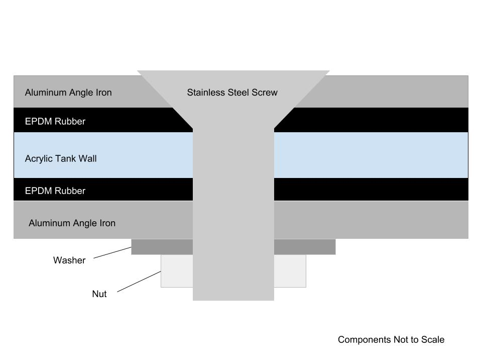

```python
from aide_design.play import*
```
# Preliminary Calculations

## Filter Dimensions
The team must first calculate the dimensions of the sand filter space which will make up a section of the overall apparatus. To do this, HorFi takes into account the velocity at which water moves through a sand filter and the desired flow rate of the system. Since creating a 1 L/s apparatus would take all semester, the team begins with a scale model at 0.1 L/s.

Since the backwash velocity (V_backwash) is greater than the filter velocity (V_filter), it is the design constraint. With some math, the area of backwash (A_backwash) and area of flow (A_flow) may be calculated.


```python
V_filter = 1.8*(u.mm/u.s)
V_backwash = 9*(u.mm/u.s)  #the constraining velocity
Q_plant = .37*(u.L/u.s)  #the scale we are working with for our first iteration of the filter, manipulated to achieve desired width
A_backwash = Q_plant/V_backwash #plan view area of sand (x,y axis)
A_flow = Q_plant/V_filter  #cross sectional area of sand (x,z axis)
```
From here, the team must incorporate some knowledge on the depth in which water travels through a traditional AguaClara OStaRS filter. The filter backwash ratio is the ratio between settled sand height during filtration and expanded sand height during backwash. Because the filter backwash ratio is 1.3 (PiFiBw), which has been empirically determined, the team must determine a settled sand height first.

The team decides that with the scale model in mind, 4 cm of sand in the flow direction (filter_length) is a fair parameter to start with. With this one measurement, and the ratio between filter velocity and backwash velocity, all other parameters fall into place.

```python
PiFiBw = 1.3
filter_length = 3.65*u.inch  #manipulated to achieve desired height
filter_width = A_backwash/filter_length #the filter width is the width for BOTH areas
filter_height = A_flow/filter_width #height of sand
box_height = filter_height*PiFiBw #the height the expanded sand bed
#the box we ordered is 18 inch by 18 inch by 24 inch with wall thickness of 0.25 inches
print(box_height.to(u.inch)) #must be 0.25 less than actual because of thickness of the box floor ordered
print(filter_width.to(u.inch)) #must be 0.25*2 less than actual because of thickness of walls on either side
print('The height of the tank should be at least',box_height.to(u.inch),'with a cross-sectional width of',filter_width.to(u.inch),'(thicknesses omitted).')
>>> height is 23.72 inches, cross sectional width of 17.46 inches
```

Another aspect of design that the team will need to  determine is the dimensions of the filter shelves that will prevent sand from leaving the filter. Determining these dimensions involves the settling velocity of sand, distance between shelves (S), number of holes, and the forces that will be acting on the shelves during normal operation and during backwash.

A safety factor of 2 will be used for the capture velocity of the sand to further ensure sand will not escape.

Below is the equation for terminal settling velocity where d is diameter, $\nu$ is kinematic viscosity
$$ Vt = \frac{d^2g}{18\nu}(\frac{\rho_{particle}-\rho_{H2O}}{\rho_{H2O}}) $$

```python
rho_sand = 1602*u.kg/u.m**3
rho_water = 1000*u.kg/u.m**3
nu_water = 1*10**-6 *u.m**2/u.s
d_sand = .5*u.mm
SF = 2 #safety factor
angle_settling = 60*u.degrees

V_settling=(d_sand**2)*pc.gravity/(18*nu_water)*((rho_sand-rho_water)/rho_water)
V_settling.to(u.mm/u.s)
>>>82 mm/s
V_capture = V_settling/SF
V_capture.to(u.mm/u.s)
>>>41 mm/s

diam_hole = 1*u.inch
num_holes = 1


###number of holes in the wall! what saize based on how many seems reasonable
#while num_holes < 100:

  #diam_hole = diam_hole- .01*u.inch
  #area_hole = pc.area_circle(diam_hole)
  #num_holes = (flow_max_tank/(V_filter*area_hole)).magnitude

#print(diam_hole)

#Let's say we have 100 .25" holes, 10x10 so spacing is 1.8"
a_hole = pc.area_circle(.25*u.inch)
n_holes = 100
a_holes = a_hole*n_holes
V_max_holes = (Q_plant/a_holes).to(u.mm/u.s)
V_max_holes
>>> 116.83269 mm/s


#prelim calc for filter length with full box

V_alpha=1.8*u.mm/u.second #upflow filter speed!
S=(1.8*u.inch).to(u.mm) #distance between shelves
alpha=60*u.degrees #angle of shelves

L=(((V_max_holes*S/V_capture)-S)/(np.cos(alpha)*np.sin(alpha)))
L.to(u.inch)
>>> 7.6893 inch
#a negativ length makes no sense

num_shelves = 20
V_sand_total = filter_width*filter_length*filter_height+(num_shelves*((L**2)/2)*np.sin(alpha)*np.cos(alpha)*filter_width)
V_sand_total.to(u.inch**3)
>>> 5632.63 in^3
V_sand_rect = filter_width*filter_length*filter_height
V_sand_rect.to(u.inch**3)
>>> 1162.933 in^3

```
2.52mm/s

```python
D_tube = .80*u.inch
Q_floc = .82*u.ml/u.s
V_floc = Q_floc/((D_tube**2)*np.pi/4)
V_floc.to(u.mm/u.s)
Q_floc.to(u.mL/u.min)


```

The next challenge for the team is determining the bottom geometry of the filtration box. The geometry is essential for proper backwash of the filter. With an angled bottom, all the sand within the filter should be backwashed, whereas with a flat bottom there could be dead zones of sand on the lower downstream side of the filter.

```python
angle_repose_min = 15*u.degree
angle_repose_max = 30*u.degree
#starting with the shallowest angle should work? We can also check with our sand


```

To move forward, one aspect of the design that will  take some practice is getting the gaskets just right. As see in Figure X below, the gasket system is comprised of eight parts: the acrylic sheet, two layers of EPDM rubber, two aluminum angle iron pieces, a conical head machine screw, a lock washer, and a nut.


|  |
|:--:|
| *Figure X: Schematic of gasket design.*|

|  |
|:--:|
| *Figure 1. First experimental apparatus with 1" diameter filter and 1/8" outlet tube. Influent water comes in through the bottom and out through the angled outlet and the top.* |
